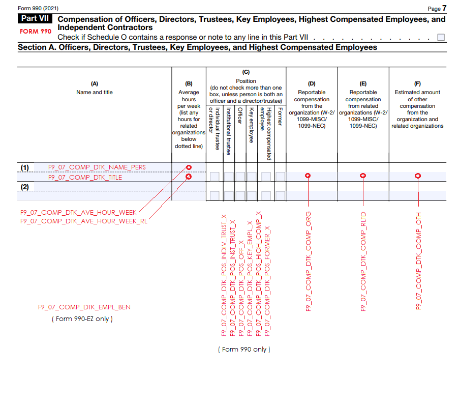

```{r setup, include=FALSE}
knitr::opts_chunk$set( echo = TRUE, message=F, warning=F, fig.width=10 )
```


## Load Packages

```{r}
library( titleclassifier )
library( dplyr )
library( pander )

raw.url <- "https://raw.githubusercontent.com/Nonprofit-Open-Data-Collective/titleclassifier/main/data-raw/"
```


## Overview 

This file updates all of the RDA objects in the package **data** folder. 

It also contains documentation about the various lists of title components and dictionaries that were created to assist with the cleaning and disambiguation of raw title strings. 

#### Lists Used for Cleaning

* [date.words](https://github.com/Nonprofit-Open-Data-Collective/titleclassifier/blob/main/data-raw/date-words.R)
* [number.words](https://github.com/Nonprofit-Open-Data-Collective/titleclassifier/blob/main/data-raw/number-words.R) 
* [likely.subjects](https://github.com/Nonprofit-Open-Data-Collective/titleclassifier/blob/main/data-raw/likely-subjects.R)
* [likely.titles](https://github.com/Nonprofit-Open-Data-Collective/titleclassifier/blob/main/data-raw/likely-titles.R)
* [possible.titles](https://github.com/Nonprofit-Open-Data-Collective/titleclassifier/blob/main/data-raw/possible-titles.R)                    


#### Disambiguation Lists:

- likely.subjects: used in **fix_of()**  
- possible.titles: used in **fix_of()** 
- likely.titles: used in **standardize_conj()** and its helper functions  


#### Temporary Status:

Titles are often accompanied by some adjective describing a **temporary or temporal period** in which the person holds the title (*former, future, interim, etc.*). 


* [former.words](https://raw.githubusercontent.com/Nonprofit-Open-Data-Collective/titleclassifier/main/data-raw/former-words.R): synonyms for "former" 
* [interim.words](https://raw.githubusercontent.com/Nonprofit-Open-Data-Collective/titleclassifier/main/data-raw/interim-words.R)
- future.words
* [regional.words](https://raw.githubusercontent.com/Nonprofit-Open-Data-Collective/titleclassifier/main/data-raw/regional-words.R): common regions used for identifying regional qualifiers in titles like "Vice President of REGION-X" 
* [possible.region.list](https://raw.githubusercontent.com/Nonprofit-Open-Data-Collective/titleclassifier/main/data-raw/possible-regional-list.R): titles that might have regional designations 

For example, the **former.word** objects are used to create the "former" flag to designate that an individual is a former or outgoing status in her/his position:


```{r, eval=T, echo=F}
former.words %>% head() 
```

These phrases are removed from the titles and flags are created for each. Note that status here describes time, not hierarchy. They are used in [gen_status_codes()](https://github.com/Nonprofit-Open-Data-Collective/titleclassifier/blob/main/R/06-gen-status-codes.R):


<br><hr><br>


### Updating Data

This guide is an overview on how to update these lists and dictionaries used in data cleaning steps. 

There are two types of lists:

(1) Text files (.R extensions) on GitHub in the [**raw data folder**](https://github.com/Nonprofit-Open-Data-Collective/titleclassifier/tree/main/data-raw). These files can be edited directly on GitHub, then after saving changes this file is run to refresh the rda data objects used by functions in the package (rda objects in the data folder). 

(2) Tables stored in the Google Sheet created for this project: https://docs.google.com/spreadsheets/d/1iYEY2HYDZTV0uvu35UuwdgAUQNKXSyab260pPPutP1M/edit?usp=sharing. 

These tables are edited directly in the Google Sheet, and they are read into the package dynamically each time it is run. 


<br><hr><br>


## Demo Data 

The package includes some IRS 990 Part VII data for development and demonstration purposes. 



**Data Dictionary:**

* **OBJECT_ID** - id of the xml object storing return data 
* **URL** - online location of the raw XML form from which data was derived
* **EIN** - employee identification number 
* **NAME** - organization's name 
* **TAXYR** - tax year of the data 
* **FORMTYPE** - type of IRS 990 form completed (990 or 990EZ)
* **F9_07_COMP_DTK_NAME_PERS** - director, trustee or key employee name 
* **F9_07_COMP_DTK_TITLE** - title 
* **F9_07_COMP_DTK_AVE_HOUR_WEEK** - hours worked per week over tax period (scope PZ) 
* **F9_07_COMP_DTK_AVE_HOUR_WEEK_RL** - hours worked for a related entity (scope PC)
* **F9_07_COMP_DTK_COMP_ORG** - direct compensation from the nonprofit; salary or wages (scope PZ) 
* **F9_07_COMP_DTK_COMP_RLTD** - compensated received from a related entity (scope PC)
* **F9_07_COMP_DTK_COMP_OTH** - other compensation amount received; bonus or fringe (scope PC)
* **F9_07_COMP_DTK_EMPL_BEN** - compensation amount in benefits (scope EZ)
* **F9_07_COMP_DTK_POS_FORMER_X** - checkbox designating former status (scope PC)
* **F9_07_COMP_DTK_POS_HIGH_COMP_X** - highly-compensated individual checkbox (scope PC)
* **F9_07_COMP_DTK_POS_OFF_X** - officer checkbox (scope PC)
* **F9_07_COMP_DTK_POS_INDIV_TRUST_X** - individual trustee checkbox (scope PC) 
* **F9_07_COMP_DTK_POS_KEY_EMPL_X** - key employee checkbox (scope PC)
* **F9_07_COMP_DTK_POS_INST_TRUST_X** - institutional trustee checkbox (scope PC) 

See [F9-P07-T01-COMPENSATION](https://nonprofit-open-data-collective.github.io/irs990efile/data-dictionary/data-dictionary.html#f990-part-07-table-00-dir-trust-key) for more details.

```{r}
data( tinypartvii ) # 10,000 rows of part vii data
head( tinypartvii )
```

There's also a vector with some raw titles for testing purposes:

```{r}
head( raw.titles )
```


<br><hr><br>


## Internal Data Objects 

Internal data objects are stored on GitHub. 

To update these, edit the object file on GitHub then run this script (RMD file). It imports the current values from GitHub and saves new RDA files in the data folder of the package. 


### Dates (as text)

Used in the **remove_dates()** function to clean titles. 


<a href="https://github.com/Nonprofit-Open-Data-Collective/titleclassifier/blob/main/R/02-remove-dates.R" class="button"> fix_of() FUNCTION </a>


<a href="https://github.com/Nonprofit-Open-Data-Collective/titleclassifier/blob/main/data-raw/date-words.R" class="button"> EDIT OBJECT </a>


```{r}
dput( date.words )
```


**Update Internal Package Object**

```{r}
# current GitHub version
source( paste0( raw.url, "date-words.R" ) ) 
save( date.words, file="../data/date-words.rda" )
```


### Numbers (as text)

Used in the **gen_status_codes()** function to clean titles. 


<a href="https://github.com/Nonprofit-Open-Data-Collective/titleclassifier/blob/main/R/06-gen-status-codes.R" class="button"> fix_of() FUNCTION </a>


<a href="https://github.com/Nonprofit-Open-Data-Collective/titleclassifier/blob/main/data-raw/number-words.R" class="button"> EDIT OBJECT </a>


```{r}
dput( number.words )
```


**Update Internal Package Object**

```{r}
# current GitHub version
source( paste0( raw.url, "number-words.R" ) ) 
save( number.words, file="../data/number-words.rda" )
```


### Likely Subjects

Used in the **fix_of()** function as the likely subject of a possible title: 


<a href="https://github.com/Nonprofit-Open-Data-Collective/titleclassifier/blob/main/R/05-standardize-spelling.R" class="button"> fix_of() FUNCTION </a>


<a href="https://github.com/Nonprofit-Open-Data-Collective/titleclassifier/blob/main/data-raw/likely-subjects.R" class="button"> EDIT OBJECT </a>


```{r}
dput( likely.subjects )
```


**Update Internal Package Object**

```{r}
# current GitHub version
source( paste0( raw.url, "likely-subjects.R" ) ) 
save( likely.subjects, file="../data/likely-subjects.rda" )
```


<br><hr><br>


### Likely Titles 

Used in the **standardize_conj()** step and its helper functions specifically: 


<a href="https://github.com/Nonprofit-Open-Data-Collective/titleclassifier/blob/main/R/03-standardize-conj.R" class="button"> standardize_conj() FUNCTION </a>

<a href="https://github.com/Nonprofit-Open-Data-Collective/titleclassifier/blob/main/data-raw/likely-titles.R" class="button"> EDIT OBJECT </a>

```{r}
likely.titles <- 
c("PRESIDENT", "CEO", "DIRECTOR\\b", "CHAIR", "TRUSTEE\\b", "TREASURER", 
"SECRETARY", "OFFICER", "COUNSEL", "FOUNDER", "PUBLISHER", "EDITOR\\b", 
"MEMBER\\b", "\\bCOO\\b", "CFO", "MANAGER", "\\bCTO\\b", "ADMINISTRATOR", 
"\\bCRO\\b", "CURATOR", "TEACHER", "CLERK", "CONTROLLER", "LIAISON", 
"INSTRUCTOR", "GENERAL", "COMPTROLLER", "HISTORIAN", "ADVISOR", 
"ARTISTIC", "KEEPER", "CHOREOGRAPHER", "EXECUTIVE\\s*$", "CHAPLAIN", 
"\\bCMO\\b", "WEBMASTER", "ASSISTANT\\s*$", "DEAN", "GOVERNOR", 
"SERGEANT", "\\bCAO\\b", "^\\bCHIEF\\b$", "WARDEN", "MASTER", 
"MATRON", "CONDUCTOR", "REPRESENTATIVE", "COORDINATOR", "ACCOUNTANT"
)
```


```{r}
# current GitHub version
source( paste0( raw.url, "likely-titles.R" ) ) 
save( likely.titles, file="../data/likely-titles.rda" )
```

<br><hr><br>


### Possible Titles 

Used in the **fix_of()** function as the possible title of a likely subject: 

https://github.com/Nonprofit-Open-Data-Collective/titleclassifier/blob/main/R/05-standardize-spelling.R

```{r}
possible.titles <- 
c("VICE PRESIDENT", "DIRECTOR", "CHAIR", 
  "DEAN", "TRUSTEE", "CEO", "SECRETARY",
  "MANAGER","MEMBER"        
)
```

```{r}
dump( "possible.titles", file="possible-titles.R" )
save( possible.titles, file="../data/possible-titles.rda" )
```

<br><hr><br>


## Google Sheets Data Objects 

These data are imported into the package via tables in a shared public Google Sheet: 

https://docs.google.com/spreadsheets/d/1iYEY2HYDZTV0uvu35UuwdgAUQNKXSyab260pPPutP1M/edit?usp=sharing


**Note** that these objects are read from Google Sheets in real time while running the package, so there

These can be edited online to update the title parsing functions. 

- [ ] Add an option to read from a local file if users have a custom table they prefer. 


<br><hr><br>


### Standardized Titles 

<a href="https://docs.google.com/spreadsheets/d/1iYEY2HYDZTV0uvu35UuwdgAUQNKXSyab260pPPutP1M/edit#gid=1464446536" class="button"> VIEW SHEET </a>

```{r}
googlesheets4::gs4_deauth()
df.standard <- googlesheets4::read_sheet( "1iYEY2HYDZTV0uvu35UuwdgAUQNKXSyab260pPPutP1M", 
                                          sheet="title-standardization", range="A:B",
                                          col_types = "c" )  # c = character

# fix: empty cells interpreted as NA by googlesheets4
df.standard[ is.na( df.standard ) ] <- ""
df.standard <- unique( df.standard )

df.standard %>% 
  select( title.standard, title.variant ) %>% 
  group_by( title.standard ) %>% 
  mutate( variants=n() ) %>% 
  arrange( -variants, title.standard ) %>% 
  head() %>% 
  pander()
```


```{r}
write.csv( df.standard, "google-sheets-backup/standard-titles.csv" )
save( df.standard, file="../data/standard-titles.rda" )
```


<br><hr><br>


### Domain & Hierarchy Taxonomy 

<a href="https://docs.google.com/spreadsheets/d/1iYEY2HYDZTV0uvu35UuwdgAUQNKXSyab260pPPutP1M/edit#gid=756762038" class="button"> VIEW SHEET </a>


```{r}
# googlesheets4::gs4_deauth()
google.id <- "1iYEY2HYDZTV0uvu35UuwdgAUQNKXSyab260pPPutP1M"
d.taxonomy <- 
  googlesheets4::read_sheet(  google.id,
                              sheet="title-taxonomy", range="A:T",
                              col_types = "c" )  # c = character


# fix: empty cells interpreted as NA by googlesheets4
d.taxonomy[ is.na( d.taxonomy ) ] <- ""

d.taxonomy
```


```{r}
write.csv( d.taxonomy, "google-sheets-backup/title-taxonomy.csv" )
save( d.taxonomy, file="../data/title-taxonomy.rda" )
```

<br><hr><br>


### Position Status

Many titles include qualifiers about the time-frame of the position.  

<a href="https://docs.google.com/spreadsheets/d/1iYEY2HYDZTV0uvu35UuwdgAUQNKXSyab260pPPutP1M/edit#gid=145854139" class="button"> VIEW SHEET </a>


```{r}

df.status <- 
  googlesheets4::read_sheet( "1iYEY2HYDZTV0uvu35UuwdgAUQNKXSyab260pPPutP1M", 
                              sheet="status-codes", 
                              range="A:B",
                              col_types = "c" )  # c = character

table( df.status$status.qualifier )
```

```{r}
head( df.status )
```


<br><hr><br>


#### FORMER

```{r, eval=T}
df <- filter( df.status, status.qualifier == "FORMER" )
former.words <- df$status.variant %>% unique()
former.words
```


```{r, eval=F, echo=F}
# OLD - DO WE NEED THESE? 
former.words <- 
  c( "\\bFORMER\\b", "\\bPAST\\b", "\\bEMERITUS\\b", "\\bUNTIL\\b", 
     "\\bTIL\\b", "\\bLEFT\\b", "\\bLEAVING\\b", "\\bTERM ENDED\\b", 
     "\\bTERM END\\b", "\\bTERM EXPIRED\\b", "\\bEXPIRED\\b", "\\bENDED\\b", 
     "\\bEND$", "\\bEXPIRE\\b", "\\bENDING\\b", "\\bRETIRED\\b", "\\bRETIRING\\b", 
     "\\bRESIGN\\b", "\\bRESIGNING\\b", "\\bRESIGNED\\b", "\\bCEASED\\b", 
     "\\bPRIOR\\b", "\\bPREVIOUS\\b", "\\bTHRU\\b", "\\bTHROUGH\\b", 
     "\\bOUTGOING\\b", "\\bEX\\s", "\\bEX$", "\\bTHR\\b", "\\bROLLED OFF\\b"
  )
```


```{r}
dump( list="former.words", file="former-words.R" )
save( former.words, file="../data/former-words.rda" )
```


#### INTERIM 


```{r, eval=T}
df <- filter( df.status, status.qualifier == "INTERIM" )
interim.words <- df$status.variant %>% unique()
interim.words
```


#### FUTURE 


```{r, eval=T}
df <- filter( df.status, status.qualifier == "FUTURE" )
future.words <- df$status.variant %>% unique()
future.words
```


#### PARTIAL YEAR 


```{r, eval=T}
df <- filter( df.status, status.qualifier == "PARTIAL" )
partial.words <- df$status.variant %>% unique()
partial.words
```


#### REGION 

```{r}
# how do we go from 

df.region <- filter( df.status, status.qualifier == "regional" )

regional.words <- df.region$status.variant %>% unique()

sort( regional.words )
```


```{r}
dump( list="regional.words", file="regional-words.R" )
save( regional.words, file="../data/regional-words.rda" )
```


**possible.region.list**

```{r}
possible.regional.list <- 
c("VICE PRESIDENT", "PRESIDENT", "BOARD MEMBER", "COUNCIL MEMBER", 
"MEMBER", "REPRESENTATIVE", "COORDINATOR", "CEO", "DIRECTOR", 
"MANAGER", "TRUSTEE", "CHAIR", "LIAISON")
```

```{r}
dump( list="possible.regional.list", file="possible-regional-list.R" )
save( possible.regional.list, file="../data/possible-regional-list.rda" )
```


<br><hr><br>

 


<style>

.button {
  background-color: white;
  color: black;
  border: 2px solid #008CBA;
  padding: 15px 32px;
  text-align: center;
  text-decoration: none;
  display: inline-block;
  font-size: 16px;
  border-radius: 12px;
  width: 200px;
}

.button {
  transition-duration: 0.4s;
}

.button:hover {
  background-color: #008CBA; 
  color: white;
}

td{ padding: 6px 10px 6px 10px } 
th{ text-align: left; } 

body{
     font-family:system-ui,-apple-system,"Segoe UI",Roboto,Helvetica,Arial,sans-serif;
     font-size:calc(1.5em + 0.25vw);
     font-weight:300;line-height:1.65;
     -webkit-font-smoothing:antialiased;
     -moz-osx-font-smoothing:grayscale;
     margin-left:20%;
     margin-right:20%} 

#TOC {
  margin-top:30px;
  margin-bottom:80px }
  
 
a{
  color:#008CBA;
  text-decoration:inherit;
  transition:color .2s} 
  
a.selected,a:hover{color:#949494} 
article a,b,strong,th{font-weight:400} 

h1{
  font-size:2.85em; 
  margin-top:100px !important;
  margin-bottom:30px;
  color:#153243;
  font-weight: 700;
  font-style: normal;
  font-family: "Quarto A", "Quarto B", Georgia, Times, "Times New Roman", "Microsoft YaHei New", "Microsoft Yahei", serif;
  line-height: 1.125;
  letter-spacing: 0.025em;
} 
  
h2,h3,h4,h5,h6{
  font-weight:300;
  margin-top:60px !important;
  margin-bottom:30px;
  color:#008CBA;
} 

h2 {
  color:#008CBA;
} 

h3,h4,h5,h6{
  color:#008CBA;
  font-family: "Quarto A", "Quarto B", Georgia, Times, "Times New Roman", "Microsoft YaHei New", "Microsoft Yahei", serif;
}

  
p.caption {
    text-align: center;
    font-style: italic;
    margin-bottom:30px;
}


pre{
  background:#f7f7f7;
  color:black;
  border-radius:2px;
  font-size:.7em;
  margin:1.5em 0;
  padding:.8em 1.2em;
  white-space:pre-wrap;
  margin-top:30px;
  margin-bottom:40px 
}


p code{
  background:#cccccc; */
  opacity:.5;
  border-radius:4px;
  font-size:.8em;
  margin:0 .1em;
  padding:.2em .4em
} 
  
table{
  border-spacing:1px;
  /* box-shadow:0px 0px 0px 1px rgba(148,148,148,0.16) inset */
  margin-top:80px;
  margin-bottom:100px !important;
  margin-left: auto;
  margin-right: auto;
  align:center
} 

     
</style>